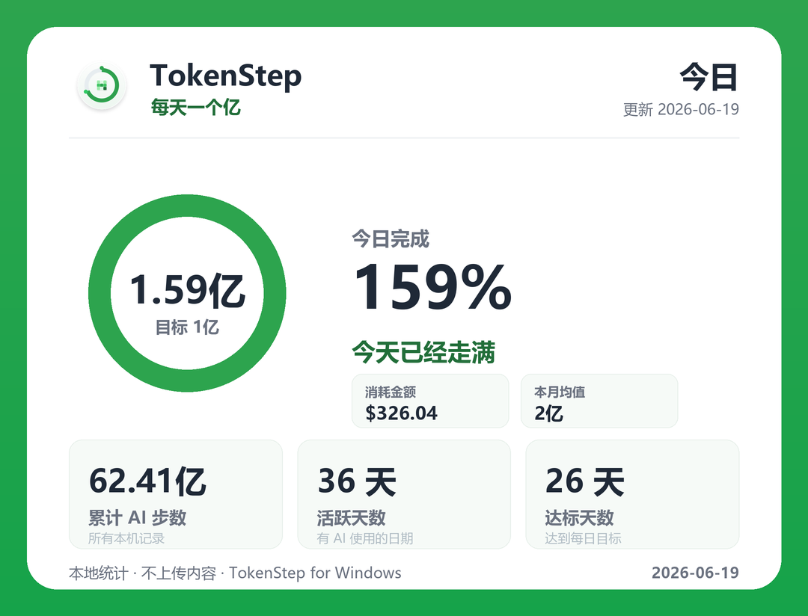

# TokenStep for Windows

TokenStep turns your AI token usage into a daily "step ring" — like a step counter,
but for AI coding. It lives in the Windows **system tray**, shows today's progress
toward a token goal, and keeps a local history dashboard.

<p align="center">
  
</p>

This is the Windows port of the macOS TokenStep menu-bar app. It reuses the same
cross-platform collector logic and matches the same data format, so the two stay
in sync conceptually. **Kept in sync through macOS v0.1.42.**

> **Credit & thanks:** This is a community **Windows port** of
> [TokenStep](https://github.com/Backtthefuture/TokenStep) (macOS) by **AI产品黄叔
> (Chaoqiang Huang)** — thank you for the original app and the "每天一个亿" idea 🙌
> Licensed under MIT; the original copyright and license are retained. Not affiliated
> with or endorsed by the original author.

## Download

Grab the latest **`TokenStep-<version>-win64.zip`** from
[Releases](https://github.com/jsun2020/TokenStep-Windows/releases), unzip, and run
`TokenStep.exe` — no install, no Python required. (The .exe is unsigned, so Windows
SmartScreen may warn on first run: **More info → Run anyway**.)

## What's new (synced from macOS)

- **0.1.43** *(Windows-only)* — **Yesterday AI Rhythm share card**, ported from the
  macOS 0.1.42 rhythm card. The tray gains **复制昨日节奏图** and **保存昨日节奏图…**:
  TokenStep buckets yesterday's tokens into 24 hourly slots, classifies the day's
  shape (双峰推进型 / 夜间 Agent 型 / 一波流型 / 碎片推进型 …), and renders a dark neon
  card with a glowing usage wave, the peak hour/value, yesterday's total, and the
  active-hours / night-share / longest-streak metrics. Data already collected (per-record
  timestamps) — no new sources, still 100% local. SF Symbols are redrawn as Pillow glyphs.
- **0.1.42** — Synced with the macOS 0.1.32–0.1.42 line, **collector parity**.
  **No more double-counting across native logs and the CC Switch proxy:** if you
  route Claude Code or Codex through the [CC Switch](https://github.com/farion1231/cc-switch)
  proxy, the same request used to be counted twice — once from the native JSONL log
  and once from the proxy database. TokenStep now matches them up (by request id, or
  by close timestamp + model + token counts) and keeps a single copy, carrying over
  the proxy's real billed cost. Gemini-via-proxy has no native source, so it is still
  counted. **Archived Codex sessions are no longer counted:** `~/.codex/archived_sessions`
  can hold restored logs with rewritten timestamps that inflated totals; only live
  sessions count now. (One-time cache rebuild on first run.) The other macOS changes in
  this line — Token Island popover polish and the new-user menu-bar default — are
  native-UI only and don't apply to this tray port; the rhythm share card is ported
  separately in **0.1.43** below.
- **0.1.32** — Synced with the macOS 0.1.29–0.1.32 line, **collector parity**.
  **More accurate Claude Code counts:** Claude Code logs each part of one response
  (thinking, text, every tool call) on its own line sharing one `message.id`.
  TokenStep now keeps a single record per response — preferring the completed one —
  instead of counting each line, so Claude totals no longer double-count multi-part
  replies. (One-time cache rebuild on first run.) The macOS-only fixes in this line
  — the autostart "drag to Applications" guard and the collector-subprocess timeout
  / sqlite-pipe hang fix — don't apply on Windows: the collector runs in-process and
  reads SQLite directly, with no helper subprocess to hang.
- **0.1.29** *(Windows-only)* — **Retain-all-history option.** By default refreshes
  skip log files older than your history window (default 180 days) for speed, so
  cumulative (累计) reflects roughly the last 6 months. Turn on **保留全部历史记录** in
  Settings to scan every log and keep all-time cumulative totals (slower on large
  log sets). Off by default.
- **0.1.28** — Synced with the macOS 0.1.15–0.1.28 line, **collector parity**. New
  **CC Switch Proxy** data source: if you route Claude/Codex/Gemini through the
  [CC Switch](https://github.com/farion1231/cc-switch) local proxy, its logged token
  usage is now counted too (read-only from `cc-switch.db`; the reader adapts to the
  installed schema). Refreshes also skip log files older than your history window
  (default 180 days) for faster collection on large histories. *Platform differences,
  on purpose:* the macOS-native UI added in this range — Token Island, the redesigned
  settings, share scorecards, and multilingual localization — is **not** ported; the
  Windows port keeps its tray + HTML dashboard and green identity.
- **0.1.15** — **In-app auto-update** (parity with macOS). When a newer release is
  found, the tray's *立即更新* downloads the win64 zip, verifies its **SHA-256** (when
  the release publishes one), swaps the portable `TokenStep.exe` via a small helper,
  and relaunches — no manual unzip/replace. It asks before downloading by default
  (toggle: 下载前先询问) and you can require a verified checksum (仅安装校验通过的版本).
  Running from source instead of the built .exe falls back to opening the download page.
- **0.1.14** — Synced with the macOS 0.1.8–0.1.14 line. The collector cache format
  is bumped (a one-time re-parse on first launch), the settings file now round-trips
  the macOS **theme** field for cross-platform compatibility, and the macOS
  duplicate-instance guard (0.1.8) is already covered here by the Windows
  single-instance mutex. *Platform difference, on purpose:* the macOS theme-color
  palettes (ocean/violet/amber/graphite) are **not** ported — Windows keeps the green
  brand identity.
- **0.1.7** — Share-card screenshot. The tray gains **复制今日截图** and
  **保存今日截图…**: TokenStep renders a branded "今日" stats card (logo, step-ring,
  今日完成 %, 消耗/本月均值, 累计/活跃/达标) and copies it to the clipboard or saves
  it as a PNG, so you can share your AI step-count to the community. (`--screenshot
  [path]` also available from the CLI.)
- **0.1.5** — Refreshed brand icon (circular base, ring + 3×3 contribution-green
  token grid), carried into the portable .exe. Dashboard brought to parity with the
  macOS "今日" view: a today step-ring hero (today vs daily goal, completion %,
  消耗金额 / 本月均值), a stat strip with 达标天数, and a daily-goal line on the
  30-day chart.
- **0.1.4** — Accurate OpenAI per-part pricing for Codex GPT-5.5 ($5 / $0.5 cached /
  $30 per 1M) and GPT-5.4 ($2.5 / $0.25 / $15). Affects cost estimates only, not
  token counts.
- **0.1.3** — Incremental collector cache (per-file, keyed by size + mtime): only
  changed logs are re-parsed, so a refresh over hundreds of MB of logs drops from
  ~8s to under 1s. Plus startup update checking (see below).
- Codex daily attribution is JSONL-first (per-event timestamps → correct per-day
  numbers), already the behaviour of this port's collector.

## What it tracks

- **Claude Code** — usage metadata from `~/.claude/projects/**/*.jsonl`
- **Codex** — token metadata from `~/.codex/sessions/**/*.jsonl` (SQLite fallback)
- **CC Switch Proxy** — per-request token counts from the CC Switch proxy log
  (`~/.cc-switch/cc-switch.db`, also checked under `%APPDATA%`), when present

On Windows, `~` is your user folder (e.g. `C:\Users\<you>`), so these are exactly
the same locations the agents already write to.

> **Privacy:** TokenStep only reads usage *metadata* — date, model, client name,
> and token counts. It never reads or uploads your code, prompts, or conversation
> content. All data stays on your machine.

## Features

- **Tray progress ring** — a live icon that fills clockwise as you approach the
  daily goal (default 1 亿 / 100M tokens).
- **Tray menu** — today's AI steps, goal %, estimated cost, and active days.
- **HTML dashboard** — daily bars, per-client and per-model breakdowns, and a
  day-by-day table. Opens in your browser.
- **Settings dialog** — daily goal, refresh interval (manual / 1 / 5 / 15 min),
  and autostart-at-login.
- **Share-card screenshot** — 复制今日截图 / 保存今日截图… render a branded "今日"
  stats card (PNG) to the clipboard or a file, for sharing to the community.
- **Rhythm share card** — 复制昨日节奏图 / 保存昨日节奏图… render a dark neon "昨日 AI
  节奏" card: yesterday's hourly usage wave, the day's pattern, peak hour, and the
  active-hours / night-share / longest-streak metrics.
- **Autostart** — optional launch on login via the Windows Run registry key.
- **Auto-update** — on launch (toggle: 启动时检查更新) and via the tray's
  *检查更新* item, it checks GitHub Releases. If a newer version exists, the built
  .exe can **download, verify (SHA-256), install, and relaunch** itself from the
  tray's *立即更新* (asks first by default; 下载前先询问 / 仅安装校验通过的版本
  toggles). When run from source it instead opens the download page.
- **Local storage** — everything under `%APPDATA%\TokenStep`.

## Requirements

- Windows 10/11
- Python 3.10+ with `pystray` and `Pillow` (`tzdata` recommended for accurate
  timezone bucketing)

```powershell
python -m pip install -r requirements.txt
```

## Run (development)

```powershell
.\run.ps1
```

This launches the tray app with `pythonw.exe` (no console window). Look for the
green ring icon in the system tray (you may need to expand the tray overflow `^`).

One-shot data refresh without the UI (handy for testing):

```powershell
python tokenstep_app.py --collect
```

## Build a portable EXE

```powershell
.\build.ps1
```

Produces a single-file, windowed `dist\TokenStep.exe` with no Python install
required on the target machine. Double-click it, or drop a shortcut in
`shell:startup` (or enable **开机自启** in Settings) to run at login.

## Data locations

| Path | Purpose |
|------|---------|
| `%APPDATA%\TokenStep\data\usage.json` | aggregated usage snapshot |
| `%APPDATA%\TokenStep\dashboard.html`  | generated dashboard |
| `%APPDATA%\TokenStep\config\settings.json` | daily goal, interval, history, timezone, update prefs |
| `%APPDATA%\TokenStep\config\pricing.json`  | editable cost estimates |
| `%APPDATA%\TokenStep\cache\collector-cache.json` | per-file parse cache (safe to delete) |
| `%APPDATA%\TokenStep\logs\tokenstep.log`   | error log |

## Settings

`settings.json` matches the macOS app:

```json
{
  "daily_goal_tokens": 100000000,
  "refresh_interval_seconds": 60,
  "history_days": 180,
  "timezone": "Asia/Shanghai",
  "auto_update_enabled": true,
  "ask_before_downloading_updates": true,
  "require_verified_updates": true,
  "skipped_update_version": null,
  "retain_all_history": false
}
```

`retain_all_history` is Windows-only: `false` (default) skips log files older than
`history_days` for faster refreshes; `true` scans everything for all-time totals.

Cost estimates are approximate (edit `pricing.json`) and are **not** a bill.

## Notes

- **Leaderboard / ranking** is intentionally left out of this first version: it is
  **local-only** for now. The snapshot in `usage.json` is a clean, stable shape to
  POST to a shared backend later — when the group's leaderboard API is known, add
  an uploader that sends `totals` + `daily` (no content) on each refresh.
- Timezone defaults to `Asia/Shanghai`. Windows lacks the IANA tz database; install
  `tzdata` for exact named-zone handling, otherwise it falls back to UTC+8.
